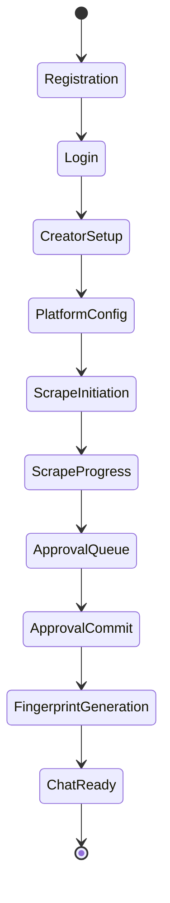
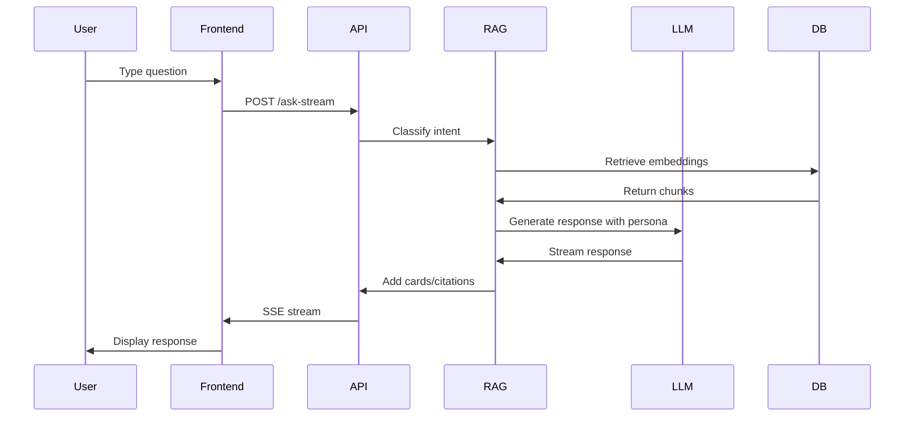

# Creator Bot — Product Requirements Document (PRD)

**Version:** 2.0  
**Last Updated:** March 30, 2026  
**Document Status:** Active — Comprehensive Specification  

---

## Executive Summary

**Creator Bot** is an enterprise-grade AI platform that enables content creators to build intelligent, persona-driven chatbots that authentically replicate their voice, knowledge, and conversational style. The platform combines advanced web scraping, semantic RAG (Retrieval-Augmented Generation), personality synthesis, and multi-modal AI to create creator-specific virtual assistants that can engage with audiences 24/7 while maintaining strict brand safety and factual accuracy.

### Core Value Proposition

- **For Content Creators**: Scale your expertise and engagement without spending more time answering repetitive questions
- **For Audiences**: Get instant, personalized answers in the creator's authentic voice with verifiable source references
- **For Businesses**: Deploy creator-branded AI assistants that maintain consistent messaging and brand identity

---

## 1. Product Vision & Strategic Goals

### 1.1 Vision Statement

To democratize AI-powered creator engagement by providing a comprehensive platform where any content creator—from educators to influencers—can build and deploy an AI assistant that authentically represents their knowledge, personality, and communication style.

### 1.2 Strategic Objectives

1. **Authenticity First**: Every response must sound like it came from the creator, not a generic AI
2. **Knowledge Grounding**: Zero hallucinations—all answers must be traceable to approved creator content or verified web sources
3. **Creator Control**: Creators maintain full ownership and approval rights over what knowledge enters their bot
4. **Scalable Intelligence**: System must handle creators with 10 videos or 10,000 videos with equal quality
5. **Multi-Platform Integration**: Support scraping and ingestion from all major social platforms

### 1.3 Target Market Segments

**Primary Markets:**
- YouTube Educators (trading, self-improvement, technical skills)
- Business Influencers (entrepreneurship, marketing, sales coaching)
- Course Creators (with established content libraries)

**Secondary Markets:**
- Podcasters seeking audience engagement
- Corporate thought leaders
- Professional consultants

**Market Size Indicators:**
- 51M+ content creators worldwide (2026)
- Creator economy valued at $250B+ globally
- 67% of creators struggle with audience engagement scaling

---

## 2. User Personas & Use Cases

### 2.1 Primary User Personas

#### Persona 1: Alex — The Educational YouTuber
- **Profile**: 200K subscribers, trading education, 500+ videos
- **Pain Points**: Same questions asked repeatedly, can't scale 1-on-1 guidance
- **Goals**: Provide personalized advice, recommend specific videos, maintain authentic voice
- **Technical Comfort**: Medium (can follow setup wizards, needs UI polish)

#### Persona 2: Sarah — The Business Coach
- **Profile**: 50K followers across platforms, premium courses, active LinkedIn
- **Pain Points**: Lead qualification, course recommendations, timezone limitations
- **Goals**: Pre-qualify leads, automate course guidance, 24/7 availability
- **Technical Comfort**: Low (needs white-glove onboarding)

#### Persona 3: Mike — The Tech Tutorial Creator
- **Profile**: 500K+ subscribers, highly technical content, GitHub repos
- **Pain Points**: Documentation maintenance, version-specific advice, code troubleshooting
- **Goals**: Provide version-accurate code help, link to specific repos, maintain technical precision
- **Technical Comfort**: High (comfortable with APIs, wants customization)

### 2.2 Core Use Cases

#### Use Case 1: New Creator Onboarding
**Actor**: First-time creator (Sarah)  
**Trigger**: Creator signs up and wants to build their bot  

**Flow**:
1. Creator enters name, selects profile picture
2. Adds social media handles (YouTube, Instagram, TikTok, LinkedIn)
3. System validates URLs and scrapes profile metadata
4. Creator configures platform-specific settings (time filters, content limits)
5. System initiates background scraping jobs
6. Creator reviews scraped content in approval interface
7. Creator approves/denies items (bulk or individual)
8. System generates personality fingerprint from approved content
9. Creator tests bot in chat interface
10. Creator receives shareable bot link or embed code

**Success Criteria**:
- Creator completes onboarding in <15 minutes
- Bot produces recognizable responses within 24 hours
- Creator feels confident the bot represents them accurately

#### Use Case 2: Audience Member Asking a Question
**Actor**: End user (student of Alex's trading course)  
**Trigger**: User asks "What's the best video for learning market structure?"  

**Flow**:
1. User types question in chat interface
2. System classifies intent as "specific resource recommendation"
3. System retrieves relevant chunks from approved knowledge base
4. System scores video matches using title, transcript, and semantic similarity
5. System applies confidence thresholding (strong match: 1 video, moderate: 2-3 videos, weak: channel fallback)
6. System generates creator-styled response with embedded video cards
7. User clicks video card to watch
8. System logs recommendation feedback for quality improvement

**Success Criteria**:
- Response generated in <3 seconds
- Response sounds authentically like Alex
- Video recommendation is relevant and helpful (verified by click-through)
- Sources are clearly attributed

#### Use Case 3: Incremental Knowledge Update
**Actor**: Creator (Alex) publishes new video  
**Trigger**: Creator manually re-scrapes or sets up automated scraping  

**Flow**:
1. Creator clicks "Update Knowledge" in dashboard
2. System scrapes new content since last run (cursor-based pagination)
3. System detects 5 new videos via checksum comparison
4. New items appear in approval queue with transcript status
5. Creator bulk-approves new videos
6. System chunks, embeds, and ingests new content
7. System incrementally updates personality fingerprint
8. Bot immediately has access to new knowledge

**Success Criteria**:
- New content appears in approval queue within 5 minutes
- Fingerprint update doesn't degrade existing voice quality
- New knowledge seamlessly integrates with existing corpus

#### Use Case 4: Complex Multi-Turn Conversation
**Actor**: User wants personalized learning path guidance  
**Trigger**: User asks "I'm a beginner, what's the best order to watch your videos?"  

**Flow**:
1. System classifies user as "beginner" via conversation history and keywords
2. System retrieves creator's content metadata (titles, descriptions, view order)
3. System generates personalized learning path (3-5 video sequence)
4. User asks follow-up: "What about after I finish those?"
5. System maintains conversation context via thread-based memory
6. System recommends intermediate-level content based on progression
7. System stores user preferences (skill level, learning goals) for future conversations

**Success Criteria**:
- System maintains context across 5+ turns
- Recommendations adapt to user's stated skill level
- Learning path feels personalized and actionable

---

## 3. Functional Requirements

### 3.1 Creator Onboarding & Setup

#### FR-1.1: Multi-Platform URL Input
- **Description**: Creator can input URLs from supported platforms
- **Supported Platforms**: YouTube (channel/handle), Instagram (profile/reels), TikTok (profile), LinkedIn (profile), Twitter/X (profile), Reddit (user)
- **Validation**: System validates URL format and accessibility before proceeding
- **Normalization**: System handles variations (@handle, full URLs, shortened links)

#### FR-1.2: Platform Configuration
- **Description**: Creator configures scrape settings per platform
- **Settings**:
  - Enable/disable platform
  - Time filter (all time, last year, last month, last week)
  - Max items per scrape (10-100)
  - Content type filters (videos only, posts only, etc.)
- **Persistence**: Settings stored in `platform_configs` JSONB column

#### FR-1.3: Visual Customization
- **Description**: Creator customizes bot appearance
- **Options**: Profile picture URL, brand colors, display name
- **Storage**: Stored in `visual_config` JSONB column

#### FR-1.4: Identity Verification
- **Description**: System auto-fills creator identity fields
- **Fields**: YouTube channel ID, YouTube handle, official domains, course URLs
- **Purpose**: Enables ownership verification for content recommendations

### 3.2 Content Scraping & Ingestion

#### FR-2.1: Apify Actor Integration
- **Description**: System uses Apify actors for platform-specific scraping
- **Actors Used**:
  - `apify/youtube-scraper`
  - `apify/instagram-scraper`
  - `apify/instagram-reel-scraper`
  - `apify/tiktok-scraper`
  - `apify/linkedin-posts-scraper`
  - `apify/twitter-scraper`
- **Fallback**: Graceful degradation if actor fails (log error, continue with other platforms)

#### FR-2.2: Transcript Extraction
- **Description**: System extracts video transcripts when available
- **Sources**:
  - YouTube: `youtube-transcript-api` library (primary)
  - Instagram/TikTok: Whisper API fallback
- **Quality Assessment**: System evaluates transcript quality (auto-generated vs manual, language accuracy)
- **Enrichment**: System enriches metadata with transcript presence indicators

#### FR-2.3: Content Normalization
- **Description**: System normalizes scraped items to unified schema
- **Schema Fields**:
  - `item_id` (UUID)
  - `source_url` (canonical URL)
  - `title` (extracted or generated)
  - `caption` (original post text)
  - `transcript_status` (present/missing/error)
  - `published_at` (ISO 8601 timestamp)
  - `platform` (youtube/instagram/tiktok/etc.)
  - `metadata` (JSONB with platform-specific fields)
  - `preview` (truncated text for UI display)

#### FR-2.4: Duplicate Detection
- **Description**: System prevents ingestion of duplicate content
- **Method**: Checksum-based deduplication using `(source, source_id)` uniqueness constraint
- **Behavior**: If duplicate detected, skip ingestion and increment duplicate counter

#### FR-2.5: Cursor-Based Incremental Scraping
- **Description**: System tracks scrape state to avoid re-fetching old content
- **Implementation**: Store `last_item_id` and `last_fetched_timestamp` in `cursors` table
- **Benefits**: Faster subsequent scrapes, lower API costs

### 3.3 Approval Workflow

#### FR-3.1: Approval Queue Interface
- **Description**: Frontend displays all scraped items awaiting review
- **Display Fields**: Platform icon, title, preview text, transcript status, published date
- **Actions**: Approve, Deny, Bulk Approve All, Bulk Deny All
- **Filtering**: Filter by platform, transcript status, date range

#### FR-3.2: Item Review Details
- **Description**: Creator can expand item to see full content
- **Views**: Full transcript, metadata, source URL (clickable)
- **Decision Logging**: System logs approval decisions for audit trail

#### FR-3.3: Approval Commit (V2 Architecture)
- **Description**: Backend processes approval decisions in background job
- **Process**:
  1. Validate creator ownership of items
  2. Create `document` records for approved items
  3. Chunk documents (800-char chunks, 120-char overlap)
  4. Generate embeddings via OpenAI `text-embedding-3-small`
  5. Store chunks and embeddings in `chunks` table with pgvector support
  6. Queue fingerprint regeneration job
  7. Update UI progress via `search_progress` table

#### FR-3.4: Streaming Approval Progress
- **Description**: Frontend shows real-time approval progress
- **Updates**: Items approved, chunks created, embeddings generated
- **Completion**: Automatic redirect to next step after 100% completion

### 3.4 Personality Fingerprint Generation

#### FR-4.1: Automated Personality Synthesis
- **Description**: System generates creator personality profile from approved content
- **Inputs**:
  - All approved document chunks
  - Platform profile metadata
  - Public web research (via Gemini Grounding)
- **Components Generated**:
  - **Voice Profile**: Signature phrases, lexical patterns, tone markers
  - **Style Fingerprint**: Sentence structures, metaphor usage, humor level, directness
  - **Identity Fingerprint**: Bio, verified facts, businesses, products, themes, controversies
  - **Value Model**: Core beliefs, decision heuristics, worldview statements
  - **Rhythm Profile**: Response pacing, verbosity preferences, structural patterns

#### FR-4.2: Fingerprint Sub-Components

**Voice Profile (`voice_profile` JSONB)**:
- `signature_phrases`: List of creator's catchphrases
- `forbidden_phrases`: AI-ish language to avoid
- `lexical_rules`: Word choice patterns
- `tone_markers`: Indicators of creator's emotional range
- `recurring_themes`: Topics creator frequently discusses

**Style Fingerprint (`style_fingerprint` JSONB)**:
- `evidence_snippets`: Example response patterns
- `signature_moves`: Creator's unique communication tactics
- `sentence_style`: Distribution of short/medium/long sentences
- `metaphor_level`: Frequency of analogies and metaphors
- `humor_level`: 0-10 scale of humor usage

**Identity Fingerprint**:
- `bio`: Brief creator biography
- `mission`: Creator's stated purpose
- `is_verified`: Whether identity facts are web-verified
- `job_titles`: List of creator's roles
- `verified_facts`: Public consensus facts about creator
- `businesses`: Companies/brands creator owns or runs
- `products`: Products/courses creator offers
- `themes`: Content topic categories
- `affiliations`: Partnerships and collaborations
- `controversies`: Known public controversies (for boundary setting)

#### FR-4.3: Incremental Fingerprint Updates
- **Description**: System can update fingerprint without full regeneration
- **Triggers**: New content approved (>10 items), manual refresh request
- **Strategy**: Compute delta between existing and new corpus, merge profiles
- **Validation**: Ensure new fingerprint maintains voice consistency (quality scoring)

### 3.5 Conversational Intelligence (Grounded RAG)

#### FR-5.1: Query Classification
- **Description**: System classifies user intent before retrieval
- **Intent Categories**:
  - `general_knowledge`: Conceptual questions
  - `specific_resource`: User wants a video/article recommendation
  - `personal_bio`: Questions about creator's background
  - `greeting`: Conversational pleasantries
  - `out_of_domain`: Topics creator doesn't cover
  - `evidence_request`: User asking for proof/sources
- **Classifier Model**: `gpt-4o-mini` (fast classification)

#### FR-5.2: Multi-Stage Retrieval Pipeline

**Stage 1: Intent-Based Retrieval**
- If `greeting`: Use greeting service for warm, authentic opener
- If `personal_bio`: Retrieve from identity fingerprint
- If `specific_resource`: Activate ContentFinder service
- If `general_knowledge`: Proceed to semantic RAG

**Stage 2: Hybrid Retrieval (for knowledge queries)**
- **Semantic Search**: pgvector cosine similarity search on embeddings
- **Sparse Text Match**: Keyword matching on chunk text
- **Exact Text Match**: Extract quoted phrases from corpus
- **Named Resource Detection**: Extract video/course names user mentions

**Stage 3: Re-Ranking**
- Combine semantic score + text overlap score + recency boost
- Apply creator ownership filter (only return content from this creator)
- Threshold enforcement: `top_score >= 0.75` for high confidence

#### FR-5.3: Content Recommendation Engine (ContentFinder)

**Purpose**: Recommend specific creator videos with high precision

**Confidence Tiers**:
1. **Strong Match** (score ≥ 0.85): Return 1 best video
2. **Moderate Match** (0.65 ≤ score < 0.85): Return 2-3 creator-owned videos
3. **Weak Match** (score < 0.65): Return creator channel search card (fallback)

**Scoring Factors**:
- Semantic similarity (embedding distance)
- Title/transcript text overlap with query
- Beginner topic boost (for foundational content)
- Recency (newer content slight preference)
- Transcript quality (manual transcripts preferred)

**Ownership Verification**:
- YouTube: Match channel ID against `youtube_channel_id`
- Domains: Match URL domain against `official_domains`
- Courses: Match URL prefix against `course_base_urls`

**Fallback Strategy**:
- If no confident match, return `channel_search_card` with query pre-filled
- Never recommend off-brand content

#### FR-5.4: Live Web Search Integration

**Trigger Conditions**:
- User asks about recent events (detected via temporal keywords)
- User explicitly requests web search ("what does the internet say about...")
- Knowledge base retrieval fails (no relevant chunks found)
- Question involves time-sensitive data (stock prices, news)

**Provider**: Google Search via SerpAPI or Gemini Grounding

**Verification Layer**:
- Web results must pass creator ownership verification before display
- If result is from creator's domain → high trust
- If result is from affiliated partner → medium trust
- If result is from third party → present with clear attribution disclaimer

#### FR-5.5: Response Generation & Persona Enforcement

**System Prompt Construction**:
```
1. Creator Base Prompt (role definition)
2. Voice Profile (signature phrases, tone)
3. Style Fingerprint (structural patterns)
4. Identity Context (bio, verified facts)
5. User Preferences (simple English, concise, etc.)
6. Safety Guards (anti-regurgitation, prompt injection protection)
7. Support Set (retrieved chunks as evidence)
8. Task Instruction (answer question in creator's voice)
```

**Model Selection**:
- Primary: `gpt-5.2` (high-quality persona replication)
- Fallback: `gpt-4o` (if primary fails)

**Post-Processing**:
- Strip markdown artifacts if needed
- Apply rhythm shaping (adjust sentence flow)
- Score response quality (regurgitation detection)
- Extract preview cards from response (video embeds, links)

#### FR-5.6: Multi-Turn Conversation Memory

**Thread-Based State**:
- Each conversation stored in `chat_threads` table with UUID
- Messages stored in `chat_messages` table with role (user/assistant)
- Thread title auto-generated from first exchange

**Memory Extraction**:
- System extracts user facts from conversation (goals, skill level, preferences)
- Facts stored in `conversation_memories` table
- Facts retrieved on subsequent turns for personalization

**Context Window Management**:
- Recent 10 messages included in full context
- Older messages summarized via memory extraction
- Token budget enforcement (max 4000 tokens of history)

### 3.6 Chat Interface & User Experience

#### FR-6.1: Multi-Chat Sidebar (ChatGPT-Style)
- **Description**: Users can manage multiple creator chats simultaneously
- **Features**:
  - Collapsible sidebar showing all active chats
  - Chat title, creator avatar, last message preview
  - "New Chat" button with modal for chat type selection
  - Active chat highlighting
  - Close chat (minimum 1 chat retained)

#### FR-6.2: Chat Type Selection Modal
- **Options**:
  1. **Temporary Chat**: Quick chat without saving creator to DB
  2. **Existing Creator**: Select from saved creators dropdown
  3. **New Creator**: Launch full creator setup wizard

#### FR-6.3: Message Rendering
- **Text Messages**: Markdown rendering with code blocks, lists, emphasis
- **Preview Cards**: Rich media cards for videos, articles, courses
- **Citations**: Inline source references with clickable links
- **Images**: Support for both image attachments (user) and image responses (bot)

#### FR-6.4: Preview Card Types
- **Video Card**: Thumbnail, title, duration, platform icon, watch URL
- **Article Card**: Headline, excerpt, source domain, read URL
- **Course Card**: Course name, description, enrollment URL
- **Channel Search Card**: Fallback card with pre-filled search query

#### FR-6.5: Response Streaming
- **Description**: Assistant responses stream in real-time
- **Implementation**: Server-Sent Events (SSE) via `/ask-stream` endpoint
- **Chunks**: Word-by-word or sentence-by-sentence streaming
- **Completion**: Final message includes full response, cards, and citations

### 3.7 User Settings & Personalization

#### FR-7.1: Response Preference Presets
- **Description**: Users can customize response style
- **Presets**:
  - "Simple English" — Drop jargon, use everyday language
  - "Concise answers" — Be direct, minimal fluff
  - "Step-by-step explanations" — Numbered process breakdowns
  - "Friendly and conversational" — Warm, personable tone
  - "Professional and direct" — Objective, data-driven, serious
  - "Examples-first explanations" — Start with concrete stories

#### FR-7.2: User Profile Settings
- **Fields**: Display name, profile picture URL
- **Persistence**: Stored in `users` table
- **Application**: Used in conversation memory and personalization

### 3.8 Authentication & Authorization

#### FR-8.1: User Registration
- **Method**: Email + password
- **Validation**: Email format validation, password strength enforcement (min 8 chars)
- **Hashing**: bcrypt with salt rounds

#### FR-8.2: Session Management
- **Approach**: Hybrid (JWT + session table)
- **JWT Payload**: `user_id`, `email`, `exp`
- **Session Table**: `session_id`, `user_id`, `expires_at`
- **Storage**: Session ID in httpOnly cookie + localStorage JWT

#### FR-8.3: Creator Ownership Enforcement
- **Rule**: Users can only access their own creators
- **Validation**: All creator endpoints verify `creator.user_id == authenticated_user_id`
- **Database Constraint**: `creators.user_id` foreign key to `users.id`

### 3.9 Background Job System

#### FR-9.1: Durable Worker Queue
- **Implementation**: `system_jobs` table with FOR UPDATE SKIP LOCKED
- **Worker Process**: Separate Python process (`system_worker.py`)
- **Job Types**:
  - `SCRAPE`: Execute platform scrape
  - `TRANSCRIPT`: Extract transcript for video
  - `INGEST`: Chunk and embed approved content
  - `FINGERPRINT`: Generate/update personality fingerprint

#### FR-9.2: Job Progress Tracking
- **Fields**: `status`, `progress_percent`, `message`, `error_log`
- **Status Values**: `queued`, `running`, `completed`, `failed`
- **UI Updates**: Frontend polls `search_progress` table for real-time updates

#### FR-9.3: Retry Logic
- **Max Retries**: 5 attempts
- **Backoff**: Exponential (2^attempt seconds)
- **Failure Handling**: After max retries, mark job as `failed` with error details

---

## 4. Non-Functional Requirements

### 4.1 Performance

#### NFR-1.1: Response Latency
- Chat response generation: ≤3 seconds (p95)
- Search/scrape initiation: ≤500ms
- Approval commit: ≤10 seconds for 50 items

#### NFR-1.2: Throughput
- Support 100 concurrent users per creator
- Handle 10,000 messages/day per creator
- Scrape pipeline: 1000 items/minute ingestion rate

#### NFR-1.3: Database Performance
- Vector search: ≤200ms for 10K embedding search
- Index coverage: 95%+ of queries use indexes
- Connection pooling: 10 max connections per pool

### 4.2 Scalability

#### NFR-2.1: Horizontal Scaling
- API servers: Stateless, scale behind load balancer
- Worker processes: Scale independently from API
- Database: Read replicas for scaling reads

#### NFR-2.2: Data Growth
- Support creators with 10K+ documents
- Handle 1M+ chunks per creator
- Embedding storage: pgvector with HNSW indexes

### 4.3 Reliability

#### NFR-3.1: Availability
- Target: 99.5% uptime (43 hours downtime/year)
- Graceful degradation: Web search failures don't crash chat
- Error recovery: Jobs auto-retry on transient failures

#### NFR-3.2: Data Integrity
- ACID compliance via PostgreSQL
- Foreign key constraints enforced
- Checksums prevent duplicate ingestion

### 4.4 Security

#### NFR-4.1: Authentication
- Password hashing: bcrypt with 12 salt rounds
- Session expiration: 30 days
- JWT secret rotation supported

#### NFR-4.2: Authorization
- Row-level creator ownership enforcement
- API endpoints require valid session
- Rate limiting: 100 req/min per user

#### NFR-4.3: Input Validation
- Pydantic models for all API inputs
- SQL injection prevention via parameterized queries
- XSS prevention via React's built-in escaping

#### NFR-4.4: Prompt Injection Protection
- User input sanitization before LLM submission
- System prompt isolation from user content
- Output filtering for leaked system instructions

### 4.5 Maintainability

#### NFR-5.1: Code Quality
- Type hints on all Python functions
- Pydantic models for data validation
- Separation of concerns (services, models, routes)

#### NFR-5.2: Testing
- Unit tests for core services
- Integration tests for API endpoints
- End-to-end tests for critical user flows

#### NFR-5.3: Logging & Observability
- Structured logging (JSON format)
- Error tracking with stack traces
- Performance metrics (latency, throughput)

---

## 5. Data Models & Schema

### 5.1 Core Tables

#### `users`
```sql
CREATE TABLE users (
  id BIGSERIAL PRIMARY KEY,
  email TEXT UNIQUE NOT NULL,
  password_hash TEXT NOT NULL,
  display_name TEXT,
  profile_picture_url TEXT,
  response_preferences JSONB DEFAULT '{}',
  created_at TIMESTAMPTZ DEFAULT NOW()
);
```

#### `creators`
```sql
CREATE TABLE creators (
  id BIGSERIAL PRIMARY KEY,
  user_id BIGINT NOT NULL REFERENCES users(id) ON DELETE CASCADE,
  name TEXT NOT NULL,
  name_raw TEXT,
  name_suggested TEXT,
  name_flags JSONB,
  handle TEXT,
  profile_picture_url TEXT,
  platforms JSONB DEFAULT '[]',
  platform_configs JSONB DEFAULT '{}',
  visual_config JSONB DEFAULT '{}',
  style_fingerprint JSONB DEFAULT '{}',
  voice_profile JSONB DEFAULT '{}',
  youtube_channel_id TEXT,
  youtube_handle TEXT,
  official_domains TEXT[],
  course_domains TEXT[],
  course_base_urls TEXT[],
  search_mode VARCHAR(50) DEFAULT 'hybrid',
  fingerprint_status TEXT,
  fingerprint_progress JSONB,
  created_at TIMESTAMPTZ DEFAULT NOW(),
  updated_at TIMESTAMPTZ DEFAULT NOW()
);
```

#### `documents`
```sql
CREATE TABLE documents (
  id BIGSERIAL PRIMARY KEY,
  creator_id INT NOT NULL,
  source TEXT NOT NULL,
  source_id TEXT NOT NULL,
  title TEXT,
  doc_type TEXT NOT NULL, -- 'knowledge' or 'persona'
  metadata JSONB DEFAULT '{}',
  created_at TIMESTAMPTZ DEFAULT NOW(),
  UNIQUE(source, source_id)
);
```

#### `chunks`
```sql
CREATE TABLE chunks (
  id BIGSERIAL PRIMARY KEY,
  document_id INT NOT NULL REFERENCES documents(id) ON DELETE CASCADE,
  chunk_index INT NOT NULL,
  chunk_text TEXT NOT NULL,
  embedding VECTOR(1536), -- OpenAI text-embedding-3-small
  metadata JSONB DEFAULT '{}',
  created_at TIMESTAMPTZ DEFAULT NOW()
);

CREATE INDEX chunks_embedding_idx ON chunks USING hnsw (embedding vector_cosine_ops);
```

#### `chat_threads`
```sql
CREATE TABLE chat_threads (
  id UUID PRIMARY KEY DEFAULT gen_random_uuid(),
  user_id BIGINT NOT NULL REFERENCES users(id) ON DELETE CASCADE,
  creator_id BIGINT NOT NULL REFERENCES creators(id) ON DELETE CASCADE,
  title TEXT DEFAULT 'New conversation',
  title_locked BOOLEAN DEFAULT FALSE,
  last_preview TEXT,
  is_active BOOLEAN DEFAULT TRUE,
  created_at TIMESTAMPTZ DEFAULT NOW(),
  last_message_at TIMESTAMPTZ DEFAULT NOW()
);
```

#### `chat_messages`
```sql
CREATE TABLE chat_messages (
  id UUID PRIMARY KEY DEFAULT gen_random_uuid(),
  thread_id UUID NOT NULL REFERENCES chat_threads(id) ON DELETE CASCADE,
  role TEXT NOT NULL CHECK (role IN ('user', 'assistant', 'system')),
  content TEXT NOT NULL,
  metadata JSONB DEFAULT '{}',
  created_at TIMESTAMPTZ DEFAULT NOW()
);
```

#### `system_jobs`
```sql
CREATE TABLE system_jobs (
  id UUID PRIMARY KEY DEFAULT gen_random_uuid(),
  job_type TEXT NOT NULL, -- SCRAPE, TRANSCRIPT, INGEST, FINGERPRINT
  status TEXT DEFAULT 'queued', -- queued, running, completed, failed
  creator_id INTEGER,
  payload JSONB DEFAULT '{}',
  progress_percent INT DEFAULT 0,
  message TEXT,
  error_log TEXT,
  retry_count INT DEFAULT 0,
  locked_at TIMESTAMPTZ,
  locked_by TEXT,
  created_at TIMESTAMPTZ DEFAULT NOW(),
  updated_at TIMESTAMPTZ DEFAULT NOW()
);
```

### 5.2 JSONB Schema Definitions

#### `platform_configs` Structure
```json
{
  "youtube": {
    "enabled": true,
    "url": "https://youtube.com/@handle",
    "timeFilter": {"mode": "last_year"},
    "maxItems": 50
  },
  "instagram": {
    "enabled": true,
    "url": "https://instagram.com/handle",
    "timeFilter": {"mode": "all"},
    "maxItems": 30
  }
}
```

#### `style_fingerprint` Structure
```json
{
  "evidence_snippets": ["example phrase 1", "example phrase 2"],
  "signature_moves": ["always starts with a question", "uses trading metaphors"],
  "lexical_rules": {
    "signature_phrases": ["boom", "let's dive in", "here's the thing"],
    "forbidden_phrases": ["as an AI", "I don't have personal opinions"]
  },
  "value_model": {
    "core_beliefs": ["data-driven decisions", "risk management is key"],
    "decision_heuristics": ["never trade on emotion", "always have a plan"]
  }
}
```

---

## 6. API Specification (Key Endpoints)

### 6.1 Authentication

#### `POST /auth/register`
- **Request**: `{ "email": "user@example.com", "password": "password123" }`
- **Response**: `{ "message": "User registered", "user_id": 1 }`

#### `POST /auth/login`
- **Request**: `{ "email": "user@example.com", "password": "password123" }`
- **Response**: `{ "session_id": "uuid", "user_id": 1, "access_token": "jwt" }`

#### `POST /auth/logout`
- **Request**: Headers with session cookie
- **Response**: `{ "message": "Logged out" }`

### 6.2 Creator Management

#### `POST /creators/config`
- **Request**:
```json
{
  "name": "Alex Hormozi",
  "handle": "@alexhormozi",
  "profile_picture_url": "https://...",
  "platform_configs": { ... },
  "visual_config": { ... }
}
```
- **Response**: `CreatorWithConfigResponse` (includes creator ID)

#### `GET /creators`
- **Response**: `{ "creators": [ { "id": 1, "name": "...", ... } ] }`

#### `PUT /creators/{creator_id}`
- **Request**: Partial update fields
- **Response**: Updated creator object

#### `DELETE /creators/{creator_id}`
- **Response**: `{ "message": "Creator deleted" }`

### 6.3 Scraping & Ingestion

#### `POST /search`
- **Request**:
```json
{
  "creator_id": 1,
  "platform_configs": { ... }
}
```
- **Response**: `{ "search_id": "uuid", "items": [...], "platform_statuses": {...} }`

#### `POST /approve_ingest_v2/stream`
- **Request**:
```json
{
  "search_id": "uuid",
  "decisions": [
    { "item_id": "123", "decision": "approve" },
    { "item_id": "456", "decision": "deny" }
  ],
  "creator_id": 1
}
```
- **Response**: Server-Sent Events stream with progress updates

### 6.4 Chat

#### `POST /ask-stream`
- **Request**:
```json
{
  "creator_id": 1,
  "question": "What's the best video for learning market structure?",
  "thread_id": "uuid",
  "messages": [ { "role": "user", "content": "..." } ]
}
```
- **Response**: SSE stream with response chunks, final JSON includes cards and citations

#### `POST /threads`
- **Request**: `{ "creator_id": 1 }`
- **Response**: `{ "id": "uuid", "user_id": 1, "creator_id": 1, "title": "New conversation", ... }`

#### `GET /threads/{thread_id}/messages`
- **Response**: `{ "messages": [ { "id": "uuid", "role": "user", "content": "...", ... } ] }`

### 6.5 Fingerprinting

#### `POST /creators/{creator_id}/fingerprint/generate`
- **Request**: Empty body (triggers async job)
- **Response**: `{ "message": "Fingerprint generation queued", "job_id": "uuid" }`

#### `GET /jobs/{job_id}/progress`
- **Response**: `{ "status": "running", "progress_percent": 45, "message": "Analyzing style patterns..." }`

---

## 7. Technology Stack

### 7.1 Backend
- **Framework**: FastAPI 0.104.1
- **Language**: Python 3.10+
- **Server**: Uvicorn (ASGI)
- **Database**: PostgreSQL 12+ with pgvector extension
- **Connection Pooling**: psycopg-pool
- **Authentication**: bcrypt + JWT
- **Validation**: Pydantic 2.8+
- **HTTP Client**: httpx 0.27+
- **AI Models**: OpenAI SDK (GPT-4o, GPT-5.1, GPT-5.2, text-embedding-3-small)
- **Web Scraping**: Apify Client, youtube-transcript-api
- **Environment**: python-dotenv

### 7.2 Frontend
- **Framework**: React 19.2
- **Build Tool**: Vite 7.2
- **Language**: JavaScript (ES6+)
- **Styling**: CSS Modules
- **State Management**: React Hooks (useState, useReducer, useEffect)
- **HTTP Client**: Fetch API
- **Real-Time Updates**: Server-Sent Events (EventSource)

### 7.3 AI & ML Services
- **Primary LLM**: OpenAI GPT-5.2 (main responses)
- **Classification**: OpenAI GPT-4o-mini (fast intent/emotion detection)
- **Research**: Google Gemini 2.5 Flash (grounded web search)
- **Embeddings**: OpenAI text-embedding-3-small (1536 dimensions)
- **Vector Search**: pgvector with HNSW indexes

### 7.4 Third-Party Services
- **Scraping**: Apify (platform-specific actors)
- **Search**: SerpAPI or Google Search API
- **Transcription**: Whisper API (fallback for non-YouTube)

---

## 8. User Workflows

### 8.1 Complete Creator Onboarding Workflow



### 8.2 End User Chat Workflow



---

## 9. Success Metrics & KPIs

### 9.1 Creator Adoption Metrics
- **Onboarding Completion Rate**: % of creators who complete full setup
- **Time to First Response**: Average time from registration to bot answering first question
- **Creator Retention**: % of creators actively using bot after 30/60/90 days
- **Content Approval Rate**: % of scraped items approved by creator

### 9.2 Quality Metrics
- **Response Authenticity Score**: Manual evaluation of voice match (1-10 scale)
- **Factual Accuracy**: % of responses traceable to approved sources
- **Recommendation Click-Through Rate**: % of video cards clicked by users
- **Conversation Depth**: Average turns per chat thread
- **User Satisfaction**: Post-chat rating (1-5 stars)

### 9.3 Performance Metrics
- **P95 Response Latency**: 95th percentile response generation time
- **System Uptime**: % availability
- **Scrape Success Rate**: % of scrape jobs completing without errors
- **Embedding Generation Throughput**: Chunks processed per minute

### 9.4 Business Metrics
- **Active Creators**: Monthly active creators
- **Total Questions Answered**: Cumulative questions across all bots
- **Average Questions per Creator**: Proxy for value delivered
- **Premium Feature Adoption**: % of creators using advanced features

---

## 10. Future Roadmap (Beyond V1)

### 10.1 Near-Term Features (Q2 2026)
- **Multi-Creator Collaboration**: Share knowledge bases between creators
- **White-Label Embedding**: Embed bot on creator's website
- **Analytics Dashboard**: Creator-facing analytics (top questions, engagement)
- **Voice Mode**: Audio input/output for voice conversations
- **Mobile App**: Native iOS/Android apps

### 10.2 Mid-Term Features (Q3-Q4 2026)
- **Automated Scraping Triggers**: Auto-scrape on creator's publishing schedule
- **Content Gap Analysis**: Identify questions bot can't answer yet
- **A/B Testing**: Test different personality variants
- **Multi-Language Support**: Translate creator content to other languages
- **Integration Marketplace**: Connect to CRM, email, Slack

### 10.3 Long-Term Vision (2027+)
- **Enterprise Tier**: Team accounts with role-based access
- **Agency Partner Program**: White-label for agencies managing multiple creators
- **Creator Network**: Discover and follow other creator bots
- **Monetization Layer**: In-chat course enrollment, affiliate links
- **Advanced Persona Customization**: Creators fine-tune personality sliders

---

## 11. Constraints & Assumptions

### 11.1 Technical Constraints
- **LLM Dependency**: System requires OpenAI API availability
- **PostgreSQL Requirement**: pgvector extension mandatory for embeddings
- **Platform API Changes**: Scraping dependent on Apify actor maintenance
- **Embedding Dimensionality**: Locked to 1536 dims (text-embedding-3-small)

### 11.2 Business Constraints
- **Scraping Legality**: Must comply with platform ToS (fair use, public content only)
- **Data Privacy**: EU GDPR, California CCPA compliance required
- **Content Ownership**: Creators retain all rights to their content
- **Cost Structure**: OpenAI API costs scale with usage

### 11.3 Assumptions
- **Creator Has Public Content**: Platform requires existing online presence
- **English Language First**: V1 focused on English content (multi-language future)
- **Human-in-Loop Approval**: Creators willing to review scraped content
- **Platform Stability**: Social platforms maintain public access to content

---

## 12. Glossary

| Term | Definition |
|------|------------|
| **Chunk** | A 800-character segment of document text with 120-char overlap, used for embedding and retrieval |
| **Embedding** | A 1536-dimensional vector representation of text, enabling semantic similarity search |
| **Fingerprint** | A comprehensive personality profile including voice, style, and identity components |
| **Grounded RAG** | Retrieval-Augmented Generation with mandatory source attribution and factual grounding |
| **Persona** | The synthesized personality model that governs how the bot responds |
| **Preview Card** | A rich media UI component displaying video/article recommendations |
| **Thread** | A multi-turn conversation between user and bot, persisted with UUID |
| **Approval Queue** | Staging area where scraped content awaits creator review before ingestion |
| **Apify Actor** | A pre-built web scraper for specific platforms (YouTube, Instagram, etc.) |
| **pgvector** | PostgreSQL extension enabling vector similarity search via HNSW indexes |

---

## Document Change Log

| Version | Date | Author | Changes |
|---------|------|--------|---------|
| 1.0 | 2026-01-15 | Initial Team | Initial PRD draft |
| 2.0 | 2026-03-30 | AI Analyst | Comprehensive rewrite based on full codebase analysis, added all implemented features, technical specifications, and data models |

---

**End of Product Requirements Document**
