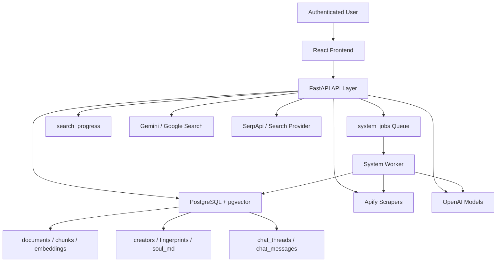

# Creator Bot System Requirements and Technical Specification

Generated from the current repository snapshot on 2026-03-28.

## 1. Purpose of This Document

This document is a current-state system requirements specification for the `Creator Bot` codebase in this repository. It is based on the implemented code, migrations, frontend workflow, and supporting technical notes already present in the project.

It answers four practical questions:

1. What the project is about.
2. What components exist.
3. How each major process works end to end.
4. What runtime, infrastructure, data, and operational requirements the system depends on.

This is not an aspirational product brief. It is a code-informed description of the system as it exists today, including legacy and transitional architecture that still lives in the repository.

## 2. Project Summary

`Creator Bot` is an AI system for building creator-specific chatbots that:

- ingest public creator content from social and web platforms,
- let a human approve the scraped content before it becomes knowledge,
- convert approved content into a retrieval-ready knowledge base,
- build a "style fingerprint" and `soul.md` persona anchor for the creator,
- answer user questions in that creator's voice using RAG, live web fallback, memory, and multiple safety/identity guardrails,
- manage persistent multi-thread chat sessions per creator and per end user.

At a product level, the system combines:

- creator onboarding,
- platform scraping,
- review and approval,
- chunking and embeddings,
- creator identity verification,
- persona synthesis,
- thread-based chat,
- user preference personalization,
- background worker orchestration,
- observability for long-running jobs.

## 3. Current Repository Snapshot

Observed from the repository:

- Backend Python files: `135`
- Frontend source files (`.jsx`, `.js`, `.css` under `frontend/anti-gravity/src`): `45`
- FastAPI route decorators in `backend/app.py`: `44`
- Service-layer files in `backend/services`: `45` including `__init__.py`
- Curated backend tests under `backend/tests`: `18`
- Additional root-level diagnostic or exploratory test scripts: `26`

Important reality of this codebase:

- The repo contains both current production-oriented flows and older or transitional logic.
- The system mixes API-driven synchronous flows, background task flows, and durable worker-queue flows.
- The repository contains debug scripts, logs, and exploratory test files in addition to core application code.

## 4. High-Level System Goals

The implemented system is designed to satisfy these goals:

1. Build a creator profile from validated public platform URLs.
2. Scrape creator content from supported platforms.
3. Stage scraped content for human review before ingestion.
4. Persist approved knowledge in a searchable vector-backed store.
5. Generate a creator-specific runtime persona and style model.
6. Answer questions in a creator-like voice while staying grounded in retrieved evidence.
7. Preserve user-specific context across conversations and threads.
8. Support preview cards and resource recommendations without leaking unrelated third-party content.
9. Track long-running jobs and expose progress to the UI.
10. Support authenticated multi-user usage with creator ownership boundaries.

## 5. Supported User and System Actors

### 5.1 Human actors

- End user: registers, logs in, creates creators, runs scraping, approves content, chats with creators.
- Operator/admin-style user: effectively the same authenticated user in the current UI; there is no separate admin console role in the visible code.

### 5.2 System actors

- FastAPI backend: primary API surface and orchestration layer.
- React frontend: creator setup wizard, approval UI, chat UI, thread sidebar, settings UI.
- Background task runner inside FastAPI: used for inline background search flows.
- Durable queue worker: `backend/services/system_worker.py`, processes `SCRAPE`, `TRANSCRIPT`, `INGEST`, and `FINGERPRINT` jobs.
- PostgreSQL + pgvector: primary persistence and vector similarity store.
- External AI/search/scrape providers: OpenAI, Gemini/Google, Apify, SerpApi or other search providers.

## 6. Technology Stack and Runtime Requirements

### 6.1 Backend

- Python 3.10+
- FastAPI
- Uvicorn
- psycopg / psycopg_pool
- Pydantic
- OpenAI SDK
- httpx
- bcrypt
- python-dotenv
- requests
- numpy
- youtube-transcript-api

### 6.2 Frontend

- Node.js 18+
- React 19
- React DOM 19
- Vite 7
- ESLint

### 6.3 Database

- PostgreSQL 12+
- `pgvector` extension required

### 6.4 Required environment variables

Required or effectively required for full system use:

- `OPENAI_API_KEY`
- `APIFY_TOKEN`
- `DATABASE_URL` or DB host/user/password variables

Optional but supported:

- `GOOGLE_API_KEY`
- `SEARCH_API_KEY` or `SERPAPI_API_KEY`
- `LIVE_SEARCH_PROVIDER`
- `JWT_SECRET_KEY`
- `JWT_ALGORITHM`
- `JWT_ACCESS_TOKEN_EXPIRE_MINUTES`
- `COOKIE_SECURE`
- `TRANSCRIBE_ON_INGEST`
- `CORS_ORIGINS`
- `FRONTEND_URL`
- `SEARCH_EXECUTION_MODE`
- `EMBED_BATCH_SIZE`

### 6.5 Configuration loading behavior

- Backend settings load from `backend/.env`.
- `load_dotenv(..., override=True)` means `backend/.env` overrides existing environment values.
- Frontend API base URL resolves from `VITE_API_BASE_URL`, otherwise same-origin for deployed hosts, otherwise defaults to `http://127.0.0.1:8000`.

## 7. Architectural Overview

### 7.1 Architectural layers

| Layer | Primary responsibility | Main files |
| --- | --- | --- |
| Presentation layer | UI workflow, chat, approvals, settings | `frontend/anti-gravity/src/App.jsx`, `frontend/anti-gravity/src/components/*` |
| API layer | Routes, auth, orchestration, response models | `backend/app.py`, `backend/models.py` |
| Scrape orchestration | Platform routing, normalization, transcript enrichment hooks | `backend/scraper_router.py`, `backend/apify_service.py`, `backend/config/platforms.py` |
| Persistence layer | DB access, search persistence, corpus state, migrations | `backend/db.py`, `backend/services/search_persistence.py`, `backend/services/corpus_state.py`, `backend/migrations/*` |
| Ingestion layer | chunking, embeddings, document/chunk lifecycle | `backend/ingest.py`, `backend/services/system_worker.py` |
| Intelligence layer | grounded response generation, interaction planning, voice/style synthesis | `backend/grounded_rag.py`, `backend/core/interaction_engine.py`, `backend/services/fingerprint_service.py`, `backend/personality_analyzer.py` |
| Worker/queue layer | durable async job execution | `backend/services/system_worker.py` |

## 8. Core Functional Subsystems

### 8.1 Authentication and session subsystem

Implemented behavior:

- Email/password registration.
- Password hashing with bcrypt.
- Session persistence through:
  - `sessions` table,
  - `session_id` cookie,
  - bearer token generated from custom JWT logic,
  - optional `X-Session-Id` support.
- `require_auth()` accepts bearer auth, cookie session, or session header.

Primary code:

- `backend/app.py`
- `backend/models.py`
- `frontend/anti-gravity/src/components/Login.jsx`
- `frontend/anti-gravity/src/api/client.js`

### 8.2 Creator onboarding subsystem

Implemented behavior:

- User creates or updates a creator with validated platform URLs and time filters.
- Platform configs are normalized and stored.
- System attempts to derive a stable handle from config or slugified name.
- Identity auto-fill attempts to enrich creator profile with verified identity metadata.
- Content-affecting creator updates increment `config_version`, which can force re-approval before chat.

Primary code:

- `backend/app.py`
- `backend/config/platforms.py`
- `backend/services/identity_manager.py`
- `frontend/anti-gravity/src/components/CreatorSetup.jsx`
- `frontend/anti-gravity/src/components/CreatorSettingsModal.jsx`

### 8.3 Search and scraping subsystem

Implemented behavior:

- Multi-platform search based on enabled creator platform configs.
- Parallel scraping per enabled platform.
- Platform-specific validation and normalization.
- Search progress persisted to DB and memory.
- Optional execution modes:
  - inline FastAPI background task,
  - durable worker queue via `system_jobs`.
- Search results are normalized and persisted into `scrape_runs` and `scrape_items`.

Supported platforms in code:

- Instagram
- YouTube videos
- YouTube Shorts
- Twitter / X
- LinkedIn
- Facebook
- TikTok
- Custom links

Primary code:

- `backend/app.py`
- `backend/scraper_router.py`
- `backend/apify_service.py`
- `backend/services/search_persistence.py`
- `backend/services/system_worker.py`

### 8.4 Approval gate subsystem

Implemented behavior:

- Scraped items are staged before ingestion.
- User can approve or deny staged items.
- Existing ingested documents can also be retained or deleted during approval resolution.
- Approved items are converted into an `INGEST` queue job.
- Denied items are marked denied.

Primary code:

- `backend/app.py`
- `frontend/anti-gravity/src/components/ApprovalGate.jsx`
- `frontend/anti-gravity/src/components/ApprovalList.jsx`

### 8.5 Ingestion subsystem

Implemented behavior:

- Approved staged items are converted into canonical documents.
- Caption + transcript are combined into ingest text.
- Content is checksummed to skip unchanged items.
- Existing chunks/embeddings are deleted before replacing changed content.
- Text is chunked with overlap.
- Chunks are embedded using OpenAI embeddings, including batch embedding optimization.
- Documents, chunks, embeddings, and creator-document links are updated.
- After ingest, creator corpus state is refreshed and fingerprint jobs may be enqueued.

Primary code:

- `backend/ingest.py`
- `backend/services/system_worker.py`
- `backend/services/corpus_state.py`

### 8.6 Transcript enrichment subsystem

Implemented behavior:

- Search flow intentionally defers some transcript work.
- Transcript jobs are queued after search completion.
- Missing transcripts can be enriched via platform-specific recovery or transcription helpers.
- Optional on-ingest transcription fallback controlled by `TRANSCRIBE_ON_INGEST`.

Primary code:

- `backend/services/transcript_worker.py`
- `backend/apify_service.py`
- `backend/lib/transcription.py`

### 8.7 Fingerprint and persona subsystem

Implemented behavior:

- Builds creator identity and style fingerprints.
- Uses public links, dossier research, and approved content analysis.
- Stores:
  - `identity_fingerprint`
  - `style_fingerprint`
  - `research_summary`
  - `soul_md`
  - fingerprint progress and timestamps
- Supports incremental fingerprint refresh when corpus changes.

Primary code:

- `backend/services/fingerprint_service.py`
- `backend/personality_analyzer.py`
- `backend/services/research_provider.py`

### 8.8 Chat and response generation subsystem

Implemented behavior:

- Thread-based creator chat.
- Streaming and non-streaming ask endpoints.
- Uses creator readiness checks before chat.
- Pulls creator fingerprint/persona and user response preferences.
- Loads recent thread history and optionally recent images.
- Routes requests through grounded RAG and interaction planning.
- Supports preview cards and resource recommendation logic.
- Stores chat messages and image metadata.
- Can auto-enqueue fingerprint generation if persona assets are missing.

Primary code:

- `backend/app.py`
- `backend/grounded_rag.py`
- `backend/core/interaction_engine.py`
- `backend/services/content_finder.py`
- `backend/services/decision_service.py`
- `backend/services/greeting_service.py`
- `backend/services/image_identity_service.py`

### 8.9 User personalization and memory subsystem

Implemented behavior:

- Per-user settings:
  - display name,
  - profile picture,
  - response preferences.
- Response preferences map to named presets such as:
  - Simple English
  - Concise answers
  - Step-by-step explanations
  - Friendly and conversational
  - Professional and direct
  - Examples-first explanations
- Memory and conversation-state utilities exist for:
  - retrieving relevant user facts,
  - maintaining memory loops,
  - adjusting responses based on user context.

Primary code:

- `backend/services/memory_service.py`
- `backend/services/memory_loop_service.py`
- `backend/core/memory_integration.py`
- `frontend/anti-gravity/src/components/UserSettingsModal.jsx`

### 8.10 Search cache and live web verification subsystem

Implemented behavior:

- External search results can be cached per creator/query/provider.
- Hybrid search mode combines ingested content with fresh public web search.
- Provider selection can fall back across Gemini, OpenAI-native search, and SerpApi.
- Ownership and creator-identity checks attempt to block unrelated links.

Primary code:

- `backend/services/research_provider.py`
- `backend/services/live_search_rules.py`
- `backend/services/web_verify.py`
- `backend/services/content_finder.py`

### 8.11 Thread management subsystem

Implemented behavior:

- Create, rename, archive, restore, list, and delete chat threads.
- Track last active thread per user and creator.
- Persist message history to `chat_messages`.
- Support image attachments in message metadata.
- Background title generation attempts to summarize conversation topic.

Primary code:

- `backend/app.py`
- `frontend/anti-gravity/src/components/ChatSidebar.jsx`
- `frontend/anti-gravity/src/components/ChatPanel.jsx`

## 9. End-to-End Process Flows

### 9.1 Process A: Register and authenticate user

1. User submits email and password from the login/register UI.
2. Backend validates credentials or creates a new user.
3. Backend hashes passwords with bcrypt.
4. Backend creates a row in `sessions`.
5. Backend returns:
   - session cookie,
   - `session_id`,
   - bearer token,
   - `user_id`.
6. Frontend stores auth identifiers and uses them on subsequent requests.

### 9.2 Process B: Create or update a creator

1. User enters creator name and platform URLs.
2. Backend validates URL shape and per-platform time filter rules.
3. URLs are normalized.
4. Handles are extracted where possible.
5. Identity auto-fill attempts to enrich creator metadata.
6. Creator row is inserted or updated.
7. If identity or content-affecting fields changed, `config_version` increments.
8. Creator status is recalculated; chat may require re-approval before use.

### 9.3 Process C: Run creator search / scrape

1. Frontend submits `creator_id` and optional platform config override.
2. Backend creates a `search_id` and initializes `search_progress`.
3. Backend chooses execution path:
   - inline background task, or
   - queued `SCRAPE` system job.
4. Platform scrapers run in parallel.
5. Results are normalized into a common item schema.
6. Search results are persisted to `scrape_runs` and `scrape_items`.
7. Platform checkpoints/statuses are merged back into creator config.
8. Search progress becomes `completed`.
9. A `TRANSCRIPT` job is usually queued after search.

### 9.4 Process D: Human approval

1. Frontend reads staged search results and displays approval UI.
2. User marks items approve or deny.
3. Existing documents may also be retained or deleted in the same review session.
4. Backend updates denied items immediately.
5. If no new approvals remain, creator approval version and corpus state are updated directly.
6. If approvals exist, backend creates an `INGEST` job in `system_jobs`.

### 9.5 Process E: Ingest approved items

1. Worker claims queued `INGEST` job.
2. Worker fetches approved `scrape_items`.
3. For each item, worker:
   - infers platform if needed,
   - extracts `content_id` and title,
   - composes text from caption + transcript,
   - computes ingest checksum,
   - skips unchanged items,
   - optionally transcribes missing media,
   - inserts or updates `documents`,
   - rebuilds `chunks`,
   - generates embeddings,
   - marks item approved/completed.
4. Worker updates creator approval version.
5. Worker refreshes corpus checksum/state.
6. If content changed, worker queues `FINGERPRINT` job.

### 9.6 Process F: Build creator fingerprint

1. Worker or API-triggered background task starts fingerprint generation.
2. System gathers creator links and domains.
3. Link-first research analyzes public identity clues.
4. Content analysis mines approved creator content for voice/style traits.
5. External search fills missing biographical or business facts.
6. Research summary and identity/style fingerprints are synthesized.
7. `soul_md` is generated.
8. Creator row is updated with new fingerprint data and progress state.

### 9.7 Process G: Start or continue a chat

1. Frontend selects a creator thread or creates a new thread.
2. User sends a question, optionally with images.
3. Backend checks creator readiness:
   - approved content exists,
   - fingerprint exists and is not broken,
   - no forced re-approval is pending.
4. Backend loads user preferences and thread history.
5. Backend stores the new user message if using a persisted thread.
6. Backend routes the request through grounded RAG logic.
7. System may:
   - retrieve vector chunks,
   - retrieve exact text matches,
   - run creator-only recommendation logic,
   - run live web fallback,
   - use image-aware processing,
   - apply memory and personalization.
8. System renders creator-style output through the interaction engine.
9. Frontend receives streamed or non-streamed answer, plus cards/sources when available.
10. Assistant reply is persisted into chat history.

### 9.8 Process H: Manage threads

1. User creates a thread for a creator.
2. Thread starts as `New conversation`.
3. Messages accumulate in `chat_messages`.
4. Background logic may generate a short title once enough context exists.
5. User can rename, archive, restore, list, or permanently delete the thread.
6. `user_creator_preferences` tracks last active thread per creator.

### 9.9 Process I: Delete creator and associated data

1. User requests creator deletion.
2. Backend verifies creator ownership.
3. Backend deletes or attempts cleanup across:
   - messages,
   - threads,
   - chunks,
   - documents,
   - scrape items / queue artifacts,
   - creator profile.
4. Frontend removes the creator and related chat state from the UI.

## 10. Data Model Requirements

### 10.1 Primary tables

| Table | Purpose |
| --- | --- |
| `users` | Authenticated users |
| `sessions` | Login sessions with expiry |
| `creators` | Creator identity, config, fingerprints, chat readiness state |
| `documents` | Approved knowledge records |
| `chunks` | Chunked document segments |
| `embeddings` | Vector embeddings for chunks |
| `scrape_runs` | Search/scrape runs and observability |
| `scrape_items` | Staged search results awaiting approval |
| `search_progress` | Search progress tracking across restarts |
| `chat_threads` | Conversation containers per creator |
| `chat_messages` | Thread messages and metadata |
| `user_creator_preferences` | Last active thread per user/creator |
| `search_cache` | Cached live-search results |
| `conversation_memories` | Per-user creator memory store |
| `system_jobs` | Durable background jobs |
| `source_items` | Advanced raw source item staging for newer pipeline |
| `scrape_cursors` | Per-creator per-platform incremental cursor state |
| `ingest_jobs` | Advanced ingestion queue from newer pipeline |
| `creator_documents` | Mapping table between creator and documents |
| `verified_facts` | Explicit verified creator fact store |
| `conversation_turns` | Interaction-engine logging table created on demand |

### 10.2 Creator-state fields with major runtime significance

The `creators` table is the main state hub. Important fields observed in code:

- identity:
  - `name`
  - `handle`
  - `profile_picture_url`
  - `youtube_channel_id`
  - `youtube_handle`
  - `official_domains`
  - `course_domains`
  - `course_base_urls`
- configuration:
  - `platform_configs`
  - `visual_config`
  - `search_mode`
  - `config_version`
  - `last_approved_version`
- persona and intelligence:
  - `identity_fingerprint`
  - `style_fingerprint`
  - `research_summary`
  - `soul_md`
  - `fingerprint_status`
  - `fingerprint_progress`
  - `fingerprint_updated_at`
- corpus integrity:
  - `content_corpus_checksum`
  - `fingerprint_corpus_checksum`

### 10.3 Search-item schema requirements

Each staged item is expected to carry at least:

- unique identifier,
- `source_url`,
- platform,
- caption and/or transcript,
- transcript status,
- published timestamp when available,
- metadata JSON,
- review status.

### 10.4 Knowledge-base requirements

Each approved knowledge item must eventually resolve to:

- one `documents` row,
- one or more `chunks` rows,
- one embedding per chunk,
- source metadata sufficient to reconstruct citations or preview cards.

## 11. API Surface Requirements

### 11.1 Auth endpoints

- `POST /auth/login`
- `POST /auth/register`
- `GET /auth/session`
- `POST /auth/logout`

### 11.2 Platform and validation endpoints

- `GET /platforms`
- `GET /platforms/{key}/validate`

### 11.3 Creator endpoints

- `GET /creators`
- `POST /creators`
- `POST /creators/config`
- `PUT /creators/{creator_id}`
- `DELETE /creators/{creator_id}`
- `GET /creators/{creator_id}/config`
- `GET /creators/{creator_id}/stats`
- `GET /creators/{creator_id}/fingerprint/status`
- `POST /creators/{creator_id}/fingerprint/generate`

### 11.4 User settings endpoints

- `GET /user/settings`
- `PUT /user/settings`

### 11.5 Search, scrape, approval, ingest endpoints

- `POST /search`
- `GET /search/{search_id}/progress`
- `GET /search/{search_id}/items`
- `POST /ingest`
- `POST /approve_ingest`
- `POST /approvals/{creator_id}/commit`
- `GET /jobs/{job_id}/progress`
- `POST /approve_ingest_v2/stream`
- `GET /creator/{creator_id}/queue`
- `POST /items/{item_id}/retry-transcript`
- `POST /scrape/run`
- `GET /scrape/runs`
- `GET /ingest/jobs`

### 11.6 Persona and chat endpoints

- `GET /creator/{creator_id}/persona`
- `POST /creator/{creator_id}/persona`
- `POST /ask`
- `POST /ask-stream`
- `POST /threads`
- `PUT /threads/{thread_id}`
- `GET /creators/{creator_id}/threads`
- `GET /threads/{thread_id}/messages`
- `DELETE /threads/{thread_id}`
- `GET /creators/{creator_id}/last_active_thread`

### 11.7 Diagnostics and health endpoints

- `GET /health`
- `GET /debug/env`

## 12. Frontend Requirements

### 12.1 Required frontend workflow stages

The main React app exposes a five-step workflow:

1. Setup
2. Search
3. Approve
4. Persona
5. Chat

### 12.2 Required frontend capabilities

The frontend must support:

- login and session restoration,
- creator onboarding and editing,
- progress display during search,
- approval gate UI,
- persona continuation flow,
- full-screen chat mode,
- thread sidebar and archived thread access,
- user settings modal,
- creator settings modal,
- preview card rendering,
- backend connectivity error reporting.

### 12.3 Frontend state expectations

The UI currently tracks:

- workflow state,
- creator list,
- threads by creator,
- archived threads by creator,
- active chat id,
- scrape progress,
- approval requirements,
- creator visual config,
- search mode,
- user settings and avatar state.

## 13. External Integration Requirements

### 13.1 OpenAI

Used for:

- embeddings,
- chat completion,
- grounded response generation,
- some fallback research,
- persona/fingerprint generation.

### 13.2 Google / Gemini

Used for:

- grounded public web search,
- link research,
- dossier generation when configured.

### 13.3 Apify

Used for:

- platform scraping,
- transcript recovery,
- multi-platform content collection.

### 13.4 Search provider layer

Supported strategy:

- Gemini first when configured,
- OpenAI-native search when configured,
- SerpApi/search API fallback.

## 14. Functional Requirements

### 14.1 Authentication and access control

- FR-01: The system must allow user registration by email and password.
- FR-02: The system must allow user login and persistent sessions.
- FR-03: The system must support bearer token and cookie-based session auth.
- FR-04: Creator-scoped operations should validate creator ownership before returning or mutating data.

### 14.2 Creator management

- FR-05: The system must store creator profiles per user.
- FR-06: The system must validate platform URLs before storing them.
- FR-07: The system must normalize platform URLs and derive handles where possible.
- FR-08: The system must track creator configuration changes that affect chat readiness.

### 14.3 Search and ingestion

- FR-09: The system must scrape content from enabled creator platforms.
- FR-10: The system must persist staged search results before ingestion.
- FR-11: The system must require explicit human approval before knowledge ingestion.
- FR-12: The system must convert approved content into documents, chunks, and embeddings.
- FR-13: The system must skip unchanged content using checksum comparison.
- FR-14: The system must support transcript enrichment as a separate process.

### 14.4 Persona and response generation

- FR-15: The system must build creator identity/style fingerprints from approved content and public signals.
- FR-16: The system must persist a runtime persona anchor (`soul_md`).
- FR-17: The system must block or limit chat when creator assets are not ready.
- FR-18: The system must answer questions using grounded retrieval from approved content.
- FR-19: The system must support streaming responses.
- FR-20: The system must support creator-owned resource recommendations and preview cards.

### 14.5 Conversation management

- FR-21: The system must persist thread history per user and creator.
- FR-22: The system must support thread creation, listing, update, archive, restore, and deletion.
- FR-23: The system must remember the last active thread per user and creator.
- FR-24: The system must store optional message metadata such as images and cards.

### 14.6 Preferences and personalization

- FR-25: The system must support user display name and avatar preferences.
- FR-26: The system must support response-style preferences that shape output format and tone.
- FR-27: The system should preserve user-context memory where supported by the current memory services.

### 14.7 Background processing

- FR-28: The system must support queued background jobs for scrape, transcript, ingest, and fingerprint tasks.
- FR-29: The system must expose progress for long-running jobs.
- FR-30: The system must preserve search progress across backend restarts where possible.

## 15. Non-Functional Requirements

- NFR-01: Backend must run as a FastAPI service on port `8000` by default.
- NFR-02: Frontend must run as a Vite app on port `5173` in development.
- NFR-03: Search and ingest operations must be observable through progress endpoints or worker job status.
- NFR-04: Database layer must support JSONB-heavy metadata and vector similarity search.
- NFR-05: Embedding generation should use batching for throughput.
- NFR-06: The system should tolerate partial platform failures during search without failing the whole run.
- NFR-07: The system should degrade gracefully when search providers or scrapers fail.
- NFR-08: Long-running background processes should be durable when `system_jobs` worker mode is enabled.
- NFR-09: Persona responses should be constrained by grounding and identity guardrails, not only raw LLM output.
- NFR-10: Startup and migrations require DB credentials with permission to create or alter tables/indexes used by runtime bootstrap logic.

## 16. Security, Privacy, and Safety Requirements

- Passwords must be hashed before storage.
- Session cookies must be `httponly`.
- `COOKIE_SECURE` must be enabled in production.
- JWT secret must be overridden from the default development value.
- Creator-scoped routes should enforce user ownership checks.
- Prompt-injection protections and preference sanitization must run before prompt assembly where used.
- Persona generation must avoid inventing unverified personal facts.
- Resource recommendation should bias toward creator-owned or verified affiliated resources.
- Image attachments are stored in DB metadata as base64 data URLs in current implementation, so storage/privacy controls should treat chat history as potentially sensitive.

## 17. Testing and Verification Coverage

### 17.1 Structured backend test coverage observed

Tests under `backend/tests` cover areas such as:

- creator status readiness
- decision service
- greeting behavior
- image identity logic
- live search rules
- name formatting
- out-of-domain handling
- platform text extraction
- preview cards
- RAG text matching
- research provider policy
- resource link policy
- stance selection
- style distillation
- text sanitization
- TikTok pipeline
- user preferences
- YouTube transcript handling

### 17.2 Additional diagnostic coverage

The repository also contains many root-level and backend-level test scripts for:

- search behavior,
- latency,
- grounding,
- memory isolation,
- database connectivity,
- classifier behavior,
- RAG pipeline experiments,
- recommendation logic.

### 17.3 Verification conclusion

The project has meaningful automated and semi-automated verification coverage, but it is mixed between:

- curated tests under `backend/tests`,
- exploratory scripts,
- debugging scripts,
- log/output artifacts stored in the repository.

## 18. Known Constraints and Current-State Risks

These are architectural realities visible in the repository:

1. The codebase contains both legacy and current implementations for some flows, especially around search, ingestion, and schema evolution.
2. Runtime schema mutation is performed in code at startup and through many migration scripts, so deployment environments must allow schema changes or migrations must be run ahead of time.
3. The application depends heavily on external APIs for scraping, embeddings, chat generation, dossier research, and transcript recovery.
4. Search behavior changes depending on environment flags such as `SEARCH_EXECUTION_MODE` and provider keys available at runtime.
5. The repository includes diagnostic scripts, logs, and generated outputs alongside core application code, which increases noise for maintainers.
6. Chat readiness depends on a combination of approval versioning, ingestion success, and fingerprint generation state.
7. Some services are clearly production-oriented, while others appear experimental or transitional; this should be accounted for in future consolidation work.

## 19. Plain-English Description of What the Project Does

In one sentence:

`Creator Bot` is a system that turns a real creator's public content into an approved, searchable, persona-aware AI chatbot that can speak in that creator's style while keeping track of user conversations and background jobs.

In practical workflow terms:

1. A user creates a creator profile.
2. The system scrapes that creator's public content.
3. The user reviews and approves what should become knowledge.
4. The system chunks and embeds the approved content.
5. The system builds a creator persona model and `soul.md`.
6. Users then chat with that creator through persistent threads.
7. The backend uses retrieved evidence, creator voice rules, live-web fallback, and safety layers to answer.

## 20. Recommended Use of This Document

This file can be used as:

- a system requirements report,
- a technical project overview,
- a software architecture summary,
- onboarding documentation for a developer,
- a client-facing explanation of what the system currently contains.

If needed, the next logical companion documents would be:

- a database ERD,
- a deployment runbook,
- an API contract document,
- a test strategy document,
- a module-by-module code map.
